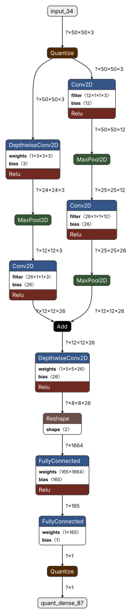

# **Wake Vision Challenge 2025 Submission - Model-Centric Track**

**DISCLAIMER:** Please use the provided `test.py` or `model_centric_track.py` script for model evaluation - the output of the model is linear uint8 and has to be converted properly

The full implementation of the method for finding the proposed model architecture can be found in [uNAS Elios Repository](https://github.com/Elios-Lab/uNAS). In this forked repository you will find:

- The `.tflite` file corresponding to the submitted model (quantized)
- The `.h5` file corresponding to the model found by uNAS, before quantization
- `train.py` - Script used to resume the training phase of the found model
- `test.py`- Slightly modified version of the original evaluation file to accomodate linear uint8 output of our model
- A brief tecnical report (`wv_report.pdf`)

For any question or issue, please send an email at my [institutional address](mailto:alessandro.pighetti@edu.unige.it) 

---

## **Model Architecture**
<div style="width:100%">
    
</div>

---
---

# 🚀 **Model-Centric Track**

Welcome to the **Model-Centric Track** of the **Wake Vision Challenge**! 🎉

This track challenges you to **push the boundaries of tiny computer vision** by designing innovative model architectures for the newly released [Wake Vision Dataset](https://wakevision.ai/).

🔗 **Learn More**: [Wake Vision Challenge Details](https://edgeai.modelnova.ai/challenges/details/1)

---

## 🌟 **Challenge Overview**

Participants are invited to:

1. **Design novel model architectures** to achieve high accuracy.
2. Optimize for **resource efficiency** (e.g., memory, inference time).
3. Evaluate models on the **public test set** of the Wake Vision dataset.

You can modify the **model architecture** freely, but the **dataset must remain unchanged**. 🛠️

---

## 🛠️ **Getting Started**

### Step 1: Install Docker Engine 🐋

First, install Docker on your machine:
- [Install Docker Engine](https://docs.docker.com/engine/install/).

---

### 💻 **Running Without a GPU**

Run the following command inside the directory where you cloned this repository:

```bash
sudo docker run -it --rm -v $PWD:/tmp -w /tmp andregara/wake_vision_challenge:cpu python model_centric_track.py
```

- This trains the [ColabNAS model](https://github.com/harvard-edge/Wake_Vision/blob/main/experiments/comprehensive_model_architecture_experiments/wake_vision_quality/k_8_c_5.py), a state-of-the-art person detection model, on the Wake Vision dataset.
- Modify the `model_centric_track.py` script to propose your own architecture.

💡 **Note**: The first execution may take several hours as it downloads the full dataset (~365 GB).

---

### ⚡ **Running With a GPU**

1. Install the [NVIDIA Container Toolkit](https://docs.nvidia.com/datacenter/cloud-native/container-toolkit/latest/install-guide.html).
2. Verify your [GPU drivers](https://ubuntu.com/server/docs/nvidia-drivers-installation).

Run the following command inside the directory where you cloned this repository:

```bash
sudo docker run --gpus all -it --rm -v $PWD:/tmp -w /tmp andregara/wake_vision_challenge:gpu python model_centric_track.py
```

- This trains the [ColabNAS model](https://github.com/harvard-edge/Wake_Vision/blob/main/experiments/comprehensive_model_architecture_experiments/wake_vision_quality/k_8_c_5.py) on the Wake Vision dataset.
- Modify the `model_centric_track.py` script to design your own model architecture.

💡 **Note**: The first execution may take several hours as it downloads the full dataset (~365 GB).

---

## 🎯 **Tips for Success**

- **Focus on Model Innovation**: Experiment with architecture design, layer configurations, and optimization techniques.
- **Stay Efficient**: Resource usage is critical—consider model size, inference time, and memory usage.
- **Collaborate**: Join the community discussions on [Discord](https://discord.com/channels/803180012572114964/1323721491736432640) to exchange ideas and insights!

---

## 📚 **Resources**

- [ColabNAS Model Documentation](https://github.com/AndreaMattiaGaravagno/ColabNAS)
- [Docker Documentation](https://docs.docker.com/)
- [Wake Vision Dataset](https://wakevision.ai/)

---

## 📞 **Contact Us**

Have questions or need help? Reach out on [Discord](https://discord.com/channels/803180012572114964/1323721491736432640).

---

🌟 **Happy Innovating and Good Luck!** 🌟
